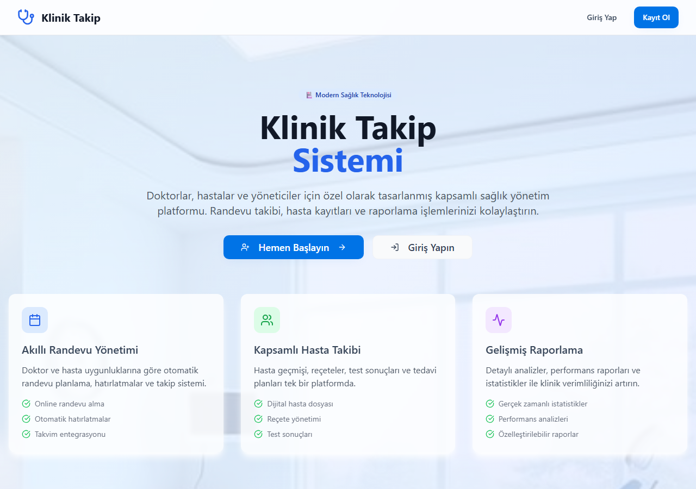
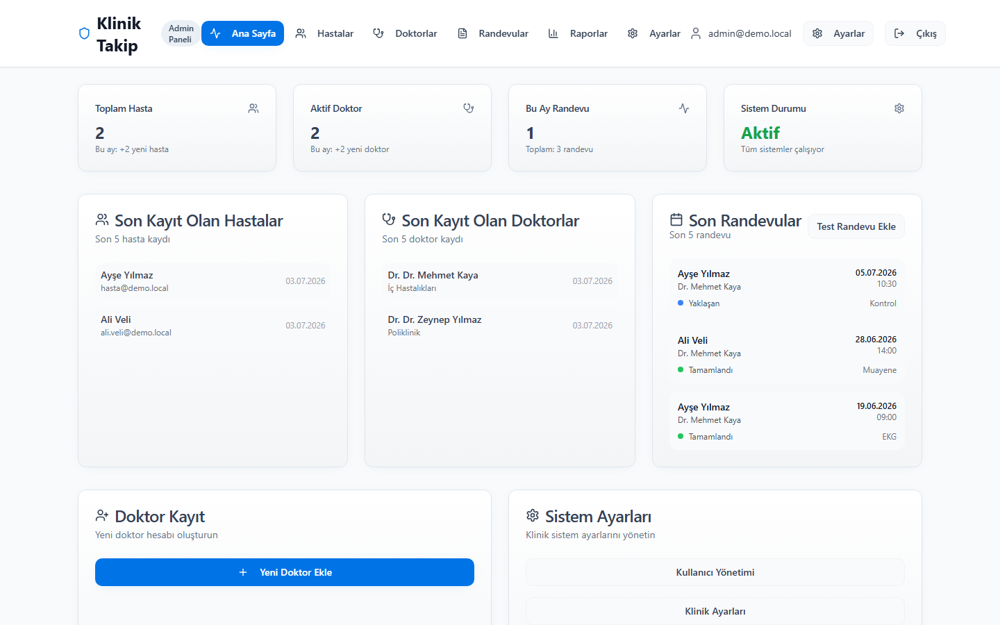
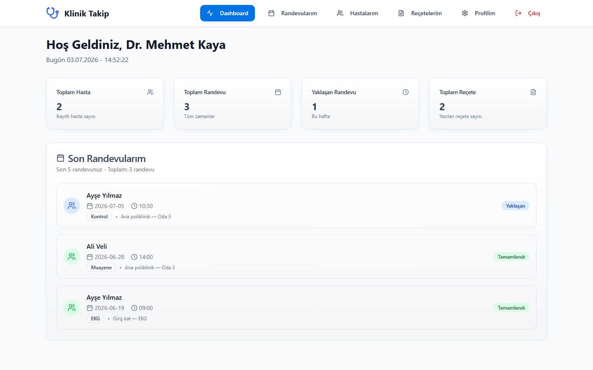
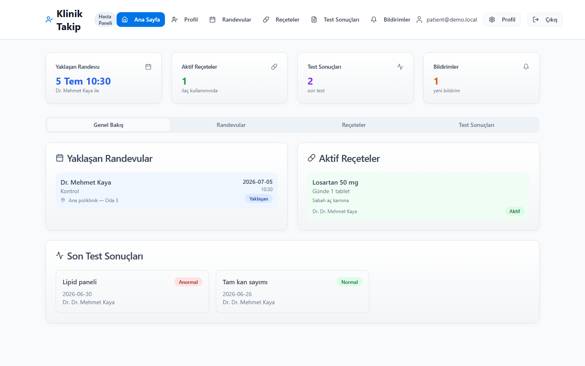

<div align="center">

# 🏥 Klinik Takip

**Hasta, doktor ve klinik yönetimini tek platformda toplayan modern sağlık takip sistemi**


</div>

---

## 📋 Hakkında

Klinik Takip; kliniklerin günlük operasyonlarını dijitalleştiren, **rol tabanlı** bir hasta ve doktor yönetim platformudur. Yönetici, doktor ve hasta üç farklı panel üzerinden randevu, reçete, test sonucu ve hasta takibini uçtan uca yönetir.

## 📸 Ekran Görüntüleri

**Ana Sayfa**



| 🛡️ Yönetici Paneli | 🩺 Doktor Paneli | 👤 Hasta Paneli |
|:---:|:---:|:---:|
|  |  |  |

## ✨ Özellikler

### 🛡️ Yönetici Paneli
- Doktor, hasta ve randevu yönetimi
- Klinik geneli raporlar ve istatistikler
- Sistem ayarları ve kullanıcı yetkilendirme

### 🩺 Doktor Paneli
- Randevu takvimi ve hasta listesi
- Reçete oluşturma ve geçmiş kayıtları
- Hasta dosyası ve profil yönetimi

### 👤 Hasta Paneli
- Randevu görüntüleme ve takip
- Reçete ve test sonuçlarına erişim
- Bildirimler ve profil yönetimi

## 🛠️ Teknoloji Yığını

| Katman | Teknolojiler |
|--------|--------------|
| Arayüz | React 18, TypeScript, Tailwind CSS, shadcn/ui |
| Build | Vite |
| Veri & Kimlik | Firebase (Firestore) · Demo oturum katmanı |
| Yönlendirme | React Router |

## 🚀 Kurulum

```bash
# Bağımlılıkları yükleyin
npm install

# Geliştirme sunucusunu başlatın (sıfır yapılandırma — demo verisiyle hazır gelir)
npm run dev

# Production build
npm run build
```

### 🔑 Demo Erişim

Uygulama **demo modunda** örnek verilerle çalışır — kayıt gerekmez, **şifre herhangi bir değer olabilir**.
Rolleri denemek için giriş ekranında şu e-postaları kullanın:

| Rol | E-posta |
|-----|---------|
| Yönetici | `admin@demo.local` |
| Doktor | `doktor@demo.local` |
| Hasta | `hasta@demo.local` |

## 👤 Geliştirici

**Emir Tiryaki** — Full Stack Developer
🌐 [emirtiryaki.com](https://emirtiryaki.com) · 📧 info@emirtiryaki.com

## 📄 Lisans

Tüm hakları saklıdır © Emir Tiryaki
